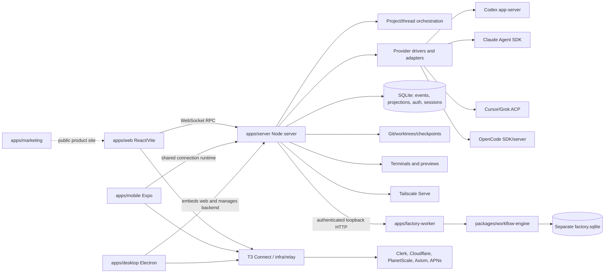
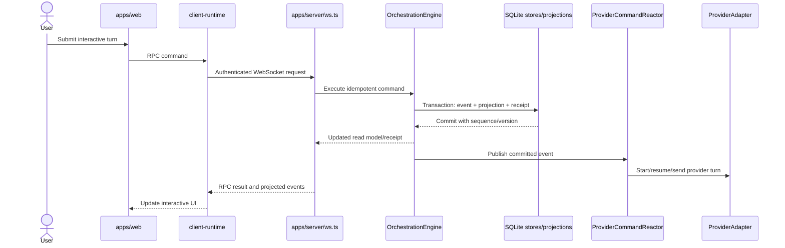
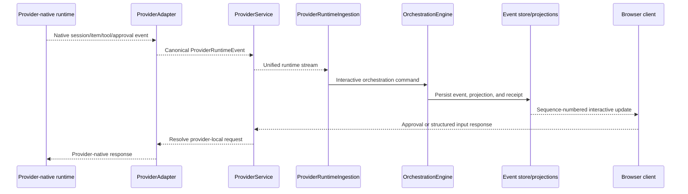

# Current architecture

This document describes the verified T3-derived architecture plus landed MK Code
fork-safety, project-registration, and factory-worker skeleton additions. The fixed derivation baseline is
`ecb35f75839925dd1ac6f854efeef5c9e291d11b`; current code has advanced beyond
that commit. Planned factory components are documented separately.

## System overview

MK Code currently retains T3 Code's monolithic interactive architecture. A Node
server owns browser RPC, provider processes, interactive orchestration, SQLite,
Git/worktrees/checkpoints, terminals, previews, authentication, and remote
exposure. React web and React Native mobile clients share connection/runtime
code. Electron embeds the same web UI and manages local/remote backends. A
separate relay application implements T3 Connect infrastructure.



## Workspace and package configuration

The root is a pnpm workspace described by `package.json`, `pnpm-workspace.yaml`,
and `pnpm-lock.yaml`. It uses Node `^24.13.1`, pnpm `11.10.0`, and repository-local
Vite+ `0.2.2`. Root scripts coordinate development, checking, tests, builds,
desktop packaging, release smoke, and reference-repository synchronization.
`scripts/dev-runner.ts:232-268` coordinates server/web/contracts development and
assigns default ports and an isolated home directory.

The principal dependency direction is:

```text
packages/contracts
    ↑
packages/shared
    ↑
packages/client-runtime
    ↑
apps/web and apps/mobile
```

`apps/server` consumes contracts, shared, Tailscale, the built web package, and
the protocol libraries. `apps/desktop` consumes client runtime, contracts,
shared, SSH, and Tailscale. `infra/relay` consumes client runtime, contracts, and
shared. `apps/marketing` is standalone.

`packages/project-config` is a new independent MK Code boundary. Contracts
depend on its schema-only export for browser-safe project registration records;
the server depends on its full parser/resolver. It does not depend on providers,
the interactive aggregate, UI packages, or process execution.

`packages/factory-contracts` is the schema-only factory wire/domain boundary.
`packages/workflow-engine` owns the synchronous `node:sqlite` state machine and
depends only on factory contracts and the resolved project snapshot schema.
`apps/factory-worker` depends on those packages and owns process configuration,
job polling, simulation handlers, and its HTTP listener. The server depends on
factory contracts only and contains an HTTP client; it has no workflow-engine or
factory-worker dependency.

## Applications

### `apps/server`

The published package/bin is still named `t3` (`apps/server/package.json:2-14`).
`apps/server/src/bin.ts:41` is the CLI entry. It resolves configuration and starts
the server; `apps/server/src/server.ts:102-355` composes HTTP/WebSocket routes,
auth, provider, orchestration, persistence, VCS, terminals, previews, cloud, and
observability layers. `apps/server/src/serverRuntimeStartup.ts:291-416` starts
projections and reactors before accepting work.

The server build depends on the web build and bundles/serves its static output
(`apps/server/vite.config.ts:23-32`, `apps/server/src/config.ts:190-208`, and
`apps/server/src/http.ts:207-267`). This coupling makes the current server both an
API host and the browser application distribution unit.

The additive `apps/server/src/factoryWorkerClient.ts` is an HTTP client for the
worker's authenticated API. It holds the service credential in a private field,
validates worker responses, and offers create/list/read/cancel/approve/event
operations. It is not yet exposed through browser RPC or used by interactive
thread orchestration. `factoryControlPlane.ts` supplies the narrow composition
that reads a currently valid/enabled registration and sends its immutable
resolved snapshot to workflow creation; it never passes the registration store
path or asks the worker to reread it.

### `apps/factory-worker`

`apps/factory-worker/src/bin.ts` is an independently runnable entry point.
`config.ts` defaults to `127.0.0.1`, rejects an unsafe bind without an explicit
override, requires `MKCODE_FACTORY_TOKEN`, and derives `factory.sqlite` from its
own state directory. `runtime.ts` opens and reconciles the engine before
listening, polls durable jobs, and drains current simulated work during graceful
shutdown.

`api.ts` authenticates all routes with a constant-time comparison of a separate
server-to-worker bearer credential. It exposes health, workflow create/list/read/
cancel, approval resolution, and cursor event retrieval. The API never accepts
an executable or mutable project-registration path.

### `apps/web`

`apps/web/src/main.tsx:21-49` boots the React application and conditionally wraps
it in Clerk when T3 Connect configuration exists. `apps/web/src/AppRoot.tsx:13`
owns application routing, state registry, preview integration, and browser host.
The same renderer supports a normal browser and Electron, so desktop bridge
checks appear throughout connection, storage, preview, settings, update, and
dialog code rather than behind one clean boundary.

Hosted-static pairing in `apps/web/src/hostedPairing.ts:34-81` can connect a
static browser bundle to a separately hosted server. `apps/web/vercel.ts:3-65`
also hard-codes T3-hosted latest/nightly routing and domains; the generic static
capability and the upstream deployment policy are distinct concerns.

### `apps/desktop`

`apps/desktop/src/main.ts:56-200` composes Electron lifecycle, backend pools,
local server management, preview automation, WSL/SSH, Tailscale exposure,
updates, Clerk, and the web renderer. `apps/desktop/src/preload.ts:136-228`
exposes tabs, screenshots, recording, element picking, and automation to the web
UI. The web application has dozens of `desktopBridge` consumers, so removing the
directory without isolating those consumers would break browser code.

### `apps/mobile`

The Expo/React Native client consumes contracts, shared, and client runtime and
has its own project/thread/diff/terminal/cloud/onboarding/notification surfaces.
`apps/mobile/app.config.ts` (notably lines 48-73, 118-159, and 279-308) contains T3-owned bundle IDs,
schemes, Clerk domain, Expo ownership, Apple team, and store identifiers. Native
modules and vendored terminal components make removal and redistribution a
licensing/build task, not a directory cleanup.

### `apps/marketing`

This is a standalone Astro site with build and typecheck but no tests. It points
to upstream T3 releases and contains T3-specific marketing, privacy, and terms.
Mobile legal URL defaults consume the site (`apps/mobile/src/features/settings/lib/legal-document-url.ts:1-35`).

### `infra/relay`

The T3 Connect relay is a separate Cloudflare Worker. `infra/relay/src/worker.ts`
handles relay APIs and events; `infra/relay/alchemy.run.ts:1-48` provisions
Cloudflare, PlanetScale/Hyperdrive, Axiom, queues, and related resources. Its
environment also requires Clerk and APNs. Server, contracts, client runtime,
web, mobile, and desktop all contain managed-cloud concepts, so relay removal
requires a staged separation from generic local auth and connection behavior.

## Shared packages

- `packages/contracts`: Effect Schema-based WebSocket, provider, model, session,
  and orchestration contracts. It is intentionally schema-only. The current
  orchestration aggregate is project/thread oriented
  (`packages/contracts/src/orchestration.ts`, notably lines 344, 601, and 805).
- `packages/project-config`: version 1 `.mkcode/project.yaml` schemas, strict YAML
  parsing, defaults, path/symlink containment, safe command descriptions,
  structured errors, and deterministic resolved snapshots
  (`packages/project-config/src/schema.ts` and `projectConfig.ts`).
- `packages/factory-contracts`: provider-neutral WorkItem, WorkflowRun,
  StageRun, Attempt, JobIntent/Lease, IdempotencyRecord, Approval, Artifact,
  WorkflowEvent, API request/result, and error schemas. It has no persistence,
  HTTP server, or UI code.
- `packages/workflow-engine`: exclusive factory SQLite migrations and current
  state, atomic transitions/outbox intents, lease claims, retries, idempotency,
  cancellation, approvals, cursor events, and reconciliation
  (`src/workflowEngine.ts`). It imports no server, browser, provider, Git, or
  command-launch implementation.
- `packages/shared`: runtime utilities shared by server and clients. It uses
  explicit subpath exports rather than a barrel. It includes project-script,
  Git, QR, platform, and general utilities.
- `packages/client-runtime`: browser/mobile connection supervision, auth/relay
  handling, RPC, and client state. `src/rpc/session.ts:67-94` creates sessions;
  connection supervision and reconnect behavior live under `src/connection`.
- `packages/effect-acp`: typed ACP stdio client/protocol used by current ACP
  providers.
- `packages/effect-codex-app-server`: typed JSON-RPC stdio bindings for Codex
  app-server.
- `packages/ssh`: desktop/remote SSH discovery and tunnel support. Some paths
  install the published `t3` CLI, coupling it to current distribution identity.
- `packages/tailscale`: discovery and `tailscale serve` management used by
  server and desktop.

## Browser startup and request flow

The browser creates a connection environment and establishes WebSocket RPC
through client runtime. The server authenticates the upgrade and handles RPC in
`apps/server/src/ws.ts`, whose `/ws` assembly ends near `ws.ts:1862` and directly
acquires many server services.

### MK Code project registration flow

`apps/server/src/ws.ts` exposes authenticated `projectRegistry.register`,
`list`, `read`, `validate`, `disable`, and `enable` methods defined in
`packages/contracts/src/projectRegistry.ts` and `rpc.ts`. Operate scope protects
mutations; read scope protects inspection. `apps/server/src/projectRegistry.ts`
canonicalizes the trusted absolute repository path, verifies a Git marker,
loads `.mkcode/project.yaml` through `@mkcode/project-config`, and atomically
replaces the versioned server-state file at
`ServerConfig.projectRegistrationsPath`.

The registration file is separate from interactive SQLite and settings. It
contains machine-local mappings and the last validated resolved snapshot, never
workflow runs or secret values. Registration and validation only read a target
repository; they do not create `.git`, write configuration, execute a described
command, or create a worktree. No browser project-management UI consumes these
methods yet; the current proof is the WebSocket integration test in
`apps/server/src/server.test.ts`.

Server startup narrows each explicitly derived state directory to `0700` on the
verified Linux target. Project-registry reads and atomic replacements enforce
`0600` on `project-registrations.json`; the atomic temporary file is also
`0600`. Permission enforcement rejects symlink state paths and does not recurse
into external repositories. Revalidation checks the stored repository path,
directory type, and Git marker before loading `.mkcode/project.yaml`, keeping
repository availability errors distinct from configuration `file_missing`.



For new worktree-backed threads, `apps/server/src/ws.ts:680-838` also performs
optional fetch, worktree creation, project setup-script terminal launch,
metadata updates, thread creation, and first-turn dispatch. Transport therefore
owns product orchestration that a future factory workspace manager must isolate.

## Provider sessions and runtime events

Five built-in drivers are registered in
`apps/server/src/provider/builtInDrivers.ts:23-47`: Codex, Claude, Cursor, Grok,
and OpenCode. `packages/contracts/src/providerInstance.ts:1-115` separates an
open-ended driver kind from a configured provider-instance ID, enabling multiple
instances per driver.

`apps/server/src/provider/Services/ProviderAdapter.ts:45` is the strongest
runtime-neutral seam: start/resume session, turns, interrupt, approvals, user
input, rollback, lifecycle, and canonical runtime events. Driver instances are
scoped and reconciled by
`apps/server/src/provider/Layers/ProviderInstanceRegistryLive.ts:109-211`.
Unavailable instances become shadow snapshots rather than crashing the registry.

Codex uses `effect-codex-app-server`; Claude uses the Anthropic agent SDK;
Cursor/Grok use ACP; OpenCode uses its SDK and may attach to or spawn a server.
Adapter implementations retain in-memory pending approvals, questions, tools,
or tasks, so their operational behavior is not fully restart-durable.



The canonical contract in `packages/contracts/src/providerRuntime.ts:148-967`
covers sessions, threads, turns, items/content, approvals, user input, task
updates, hooks, tools, status, and errors. Provider-to-thread bindings, runtime
mode/status, and resume cursors are persisted by
`apps/server/src/provider/Services/ProviderSessionDirectory.ts` and
`apps/server/src/persistence/ProviderSessionRuntime.ts`. `ProviderService` can
adopt or resume sessions after restart.

## Interactive orchestration and persistence

The domain contains project/thread aggregates and commands for thread/session/
turn lifecycle, approvals, input, messages, plans, activity, checkpoint revert,
and deletion. It does not contain WorkflowRun, StageRun, Attempt, Lease,
TeamDefinition, or Artifact aggregates.

`apps/server/src/orchestration/Layers/OrchestrationEngine.ts:128-300`
serializes commands, deduplicates them through durable receipts, and commits
events and projections transactionally. The SQLite event store records global
sequence and aggregate stream versions
(`apps/server/src/persistence/Layers/OrchestrationEventStore.ts:99`). Nine
projectors track cursors and replay persisted events at startup
(`ProjectionPipeline.ts:1462-1534`). SQLite uses WAL mode and ordered migrations
from `apps/server/src/persistence/Layers/Sqlite.ts:24-33`.

Provider commands, runtime ingestion, checkpoints, and deletion side effects
consume hot streams into local `DrainableWorker` queues. `packages/shared/src/DrainableWorker.ts:1-40`
is an unbounded in-memory queue whose drain behavior supports synchronization,
not durable claims. `RuntimeReceiptBus` is explicitly short-lived PubSub. A
process crash after event commit but before reactor execution can therefore lose
an intended side effect.

## Factory orchestration and persistence

Factory persistence is physically separate at
`<factory-state>/factory.sqlite`. Migration 1 creates `work_items`,
`workflow_runs`, `stage_runs`, `attempts`, `job_intents`,
`idempotency_records`, `approvals`, `artifacts`, and `workflow_events`.
`PRAGMA user_version` rejects databases newer than the worker. Startup is
idempotent, enables foreign keys and WAL, narrows the state directory to `0700`
and database/WAL/shared-memory files to `0600`, and rejects symlink state paths.

Workflow creation commits the WorkItem, queued WorkflowRun, planning StageRun,
pending JobIntent, initial events, and idempotency receipt in one immediate
transaction. Claims select and update under the same transaction, materialize an
Attempt, and assign an expiring owner lease. Completion validates lease
ownership and stage version, commits the next stage/job/events atomically, and
stops at a durable human-review Approval. Approval or rejection is terminal and
idempotent; cancellation atomically prevents further scheduling.

Startup reconciliation requeues expired leases, cancels jobs for cancelled
runs, repairs queued stages missing jobs and review stages missing approvals,
and marks ambiguous completed-job/uncommitted-transition state as
`operator_attention` rather than fabricating success. Events use a SQLite
autoincrement cursor and replay after restart. Current simulation handlers only
call engine transitions; they do not execute project configuration.

## Git, worktrees, checkpoints, terminals, and previews

`apps/server/src/vcs/VcsDriver.ts:41` and `VcsDriverRegistry.ts:63` define a VCS
seam, although Git is the only implementation. Worktree creation/removal lives
in `GitVcsDriverCore.ts:2245` and uses the configured root from
`apps/server/src/config.ts:108`.

Project setup scripts are written to an interactive terminal by
`apps/server/src/project/ProjectSetupScriptRunner.ts:127`; they are not awaited
through a deterministic result-capturing command runner. Git checkpoints use an
isolated index and hidden ref to capture filesystem state, while restore performs
destructive restore/clean/reset operations (`GitVcsDriver.ts:650-737`). This is
valuable interactive rollback behavior but unsafe as factory rollback without
exclusive workspace ownership.

The server exposes PTY-backed terminals and browser preview services. Electron
adds richer persistent preview tabs, screenshot/recording, and element-picking
behavior. These are useful interactive observations but do not represent durable
workflow state.

## Authentication, pairing, and remote access

The server distinguishes loopback, desktop-managed, and remote-reachable auth
policies in `apps/server/src/auth/EnvironmentAuthPolicy.ts:17-45`. Headless
startup can issue one-time pairing credentials and a terminal QR/link
(`apps/server/src/startupAccess.ts:122-147`). Session and pairing records are
persisted in SQLite. Tailscale probing and Serve management live in
`packages/tailscale/src/tailscale.ts:183-318` and match the target private remote
deployment.

T3 Connect and Clerk are separate hosted-product concerns but are not cleanly
isolated. Web/mobile conditionally present cloud auth, while the server still
composes cloud layers/routes. Removing hosted cloud behavior must preserve local
pairing and session auth.

## Telemetry and observability

Local tracing is retained through
`apps/server/src/observability/Layers/Observability.ts:17-81`; optional OTLP
exporters activate only when configured. Web traces can proxy through the
connected server.

Product analytics are separate and are now explicitly opt-in.
`apps/server/src/telemetry/AnalyticsService.ts` reads
`T3CODE_TELEMETRY_ENABLED` with a disabled default and returns a no-op service
before loading delivery configuration, HTTP services, or telemetry identity.
Opt-in requires both `T3CODE_TELEMETRY_ENABLED=true` and an explicit
`T3CODE_POSTHOG_KEY`; no upstream project key remains embedded. Only the opted-in
path calls `apps/server/src/telemetry/Identify.ts`, which may read and hash Codex
or Claude account identity before falling back to a persisted anonymous ID.

## CI, build, release, and distribution

`.github/workflows/ci.yml` is the only active GitHub Actions workflow. On pushes
to `main`, pull requests targeting `main`, and manual dispatch, an Ubuntu job
pins Node 24.16.0, activates the root `packageManager` pnpm version, installs with
the frozen lockfile, and runs check, typecheck, Electron setup, all package tests,
the production build, and release smoke through repository-local tooling. It has
read-only contents permission and no production credentials or publishing steps.
An observed `main` Actions run passed; branch-protection configuration remains
an owner-side repository setting rather than a repository file.

Inherited release, relay, EAS, and community-mutating workflows are retained
unchanged except for a disabled-reference header under
`.github/workflows-disabled/`. GitHub does not load workflows from that
directory. The former release workflow documents stable/nightly versions, relay
configuration, desktop signing, npm publication of `t3`, GitHub releases,
Vercel deployment, automated version commits, and Discord announcements. The
former relay workflow documents Cloudflare, PlanetScale, Axiom, Clerk, and APNs
requirements. None can trigger from default MK Code repository activity.

The root `pnpm run build` builds marketing, web, server, and desktop bundle
surfaces. Full signed macOS/Windows/Linux installers and iOS/Android artifacts
are release-only and were not verified locally.

## Licensing and attribution

The root `LICENSE:1-13` is MIT and retains T3 Tools Inc. copyright and permission
text. It must remain in copies or substantial portions after rebranding.
Retained component notices include:

- `apps/web/THIRD_PARTY_NOTICES.md`;
- `apps/mobile/modules/t3-markdown-text/LICENSE` and `UPSTREAM.md`;
- `apps/mobile/modules/t3-composer-editor/LICENSE`;
- `apps/mobile/modules/t3-terminal/THIRD_PARTY_NOTICES.md`;
- `apps/mobile/modules/t3-terminal/Vendor/libghostty-vt/LICENSE`; and
- the embedded Project Nayuki MIT notice in
  `packages/shared/src/qrCode.ts:3-22`.

Before any mobile redistribution, confirm the complete notice/license treatment
for bundled MesloLGS NF fonts and the iOS Ghostty framework. This is an open
review item, not a finding of noncompliance.

## Current risks

1. One server process owns too many product and operational concerns.
2. Hot-stream-to-side-effect gaps are not durable factory execution.
3. Provider approval callbacks and several pending-request maps are process-local.
4. WebSocket thread bootstrap owns Git/worktree/setup orchestration.
5. The thread model combines messages, plans, checkpoints, provider state, and UI
   flags and must not be extended into the factory aggregate.
6. Web is both browser app and Electron renderer; desktop dependencies are
   cross-cutting.
7. T3 Connect/Clerk/relay and public release concerns cross package boundaries.
8. Branding includes persisted identifiers, environment variables, paths,
   schemes, storage keys, and package names, so a global rename is unsafe.
9. Opted-in analytics still uses inherited environment-variable names and
   provider-derived identity behavior; it must remain explicit and documented.
10. Documentation has drift: for example, existing provider documentation
    understates the five current drivers, and script documentation still refers
    to older Bun/Turbo behavior and an obsolete port.
11. The JSON project-registration store is intentionally single-server and
    atomic but is not a multi-writer store; factory run state must not be added
    to it.

## Unverified areas

- Authenticated end-to-end sessions against real Claude Code, Codex, Cursor,
  Grok, and OpenCode installations.
- Browser E2E behavior; the default web tests run in a Node unit environment.
- Meaningful native mobile lint without SwiftLint, ktlint, and detekt.
- Signed cross-platform desktop installers.
- EAS mobile builds and store publication.
- Relay deployment and live T3 Connect infrastructure.
- External signing, Clerk, Cloudflare, PlanetScale, Axiom, APNs, Expo, and
  Discord workflows.
