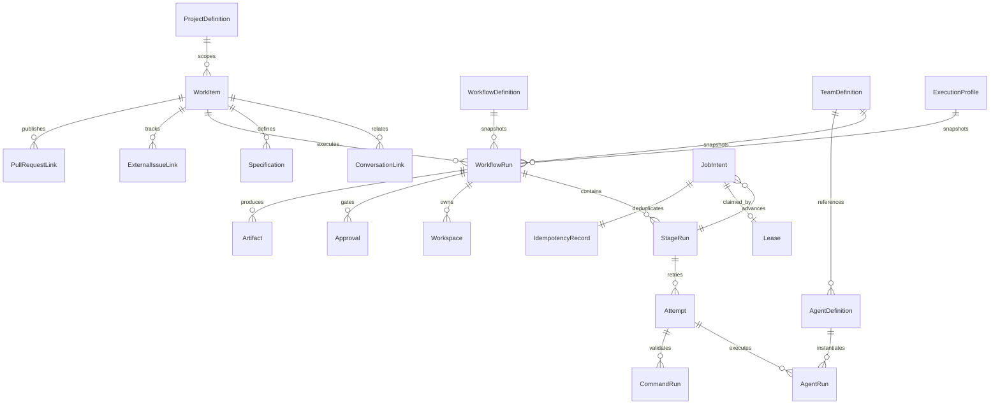

# Factory domain model

This document defines the target factory domain. None of these records should be
read as already implemented unless the current-architecture documentation says
otherwise.

## Domain boundary

The interactive domain owns human-directed projects, conversations, threads,
turns, messages, provider sessions, interactive approvals, checkpoints, diffs,
terminals, and previews. The factory domain owns durable work and execution.

A Conversation may link to a WorkItem, but neither is contained by the other.
`ThreadId`, `TurnId`, provider-native task IDs, terminal state, and process state
must never be lifecycle authorities for a WorkflowRun.

## Entity relationship

## Objects

### ProjectDefinition

- **Purpose:** registers a repository and the configuration used to operate it.
- **Identity:** stable MK Code project ID; filesystem path is mutable metadata,
  not identity.
- **Lifecycle:** registered, enabled/disabled, archived.
- **Relationships:** WorkItems, configuration snapshots, integration mappings.
- **Snapshot:** active runs capture repository revision and resolved project
  configuration.
- **Prohibited:** owning an interactive thread or storing provider credentials.

### ConversationLink

- **Purpose:** associates a WorkItem with an interactive conversation without
  merging lifecycles.
- **Identity:** WorkItem ID plus conversation/environment identity.
- **Mutable:** label and relation kind; the linked IDs are immutable.
- **Source of truth:** factory persistence for the link; interactive persistence
  for the conversation.
- **Prohibited:** determining workflow status.

### Specification

- **Purpose:** versioned problem statement, acceptance criteria, constraints, or
  imported plan attached to a WorkItem.
- **Identity:** specification ID and monotonically increasing version.
- **Lifecycle:** draft, accepted, superseded.
- **Snapshot:** a WorkflowRun records the exact accepted version it uses.
- **Prohibited:** executable commands or embedded secrets.

### WorkItem

- **Purpose:** durable statement of work independent of its intake channel.
- **Identity:** stable WorkItem ID.
- **Lifecycle:** proposed, ready, active, awaiting-review, completed, cancelled.
- **Relationships:** many conversations, specifications, workflow runs, attempts,
  and external links.
- **Mutable:** summary, prioritization, current disposition, links.
- **Prohibited:** deriving completion directly from a conversation, Linear issue,
  or pull request.

### WorkflowDefinition

- **Purpose:** versioned stage graph, gates, role requirements, retry policies,
  and transitions.
- **Identity:** definition key plus immutable version.
- **Lifecycle:** draft, active, deprecated.
- **Snapshot:** every run stores the resolved version and expanded stage graph.
- **Prohibited:** provider/model selection and arbitrary unvalidated process
  launch.

### WorkflowRun

- **Purpose:** one durable execution of a WorkItem.
- **Identity:** stable run ID.
- **Lifecycle:** queued, running, awaiting-approval, succeeded, failed, cancelled.
- **Snapshot:** project configuration, workflow, team, agents, profiles, input
  specifications, and source revision.
- **Source of truth:** factory persistence exclusively.
- **Prohibited:** silent mutation from later definition changes.

### StageRun

- **Purpose:** materialized execution state for one stage in a WorkflowRun.
- **Identity:** run ID plus stage instance ID.
- **Lifecycle:** blocked, ready, running, awaiting-approval, succeeded, failed,
  skipped, cancelled.
- **Relationships:** attempts, job intents, approvals, artifacts.
- **Prohibited:** changing status based only on runtime output.

### Attempt

- **Purpose:** one bounded try at completing a StageRun.
- **Identity:** stage ID plus attempt number.
- **Lifecycle:** queued, claimed, running, succeeded, failed, cancelled, expired.
- **Mutable:** timestamps, failure classification, lease association.
- **Prohibited:** exceeding the snapshotted retry policy.

### AgentDefinition

- **Purpose:** provider-neutral responsibility, capabilities, permissions, and
  expected input/output contract.
- **Identity:** stable definition key plus version.
- **Prohibited:** provider, model, process-host, or secret selection.

### TeamDefinition

- **Purpose:** versioned composition of orchestrator, team-lead, and worker role
  slots, including delegation policy.
- **Identity:** stable definition key plus version.
- **Prohibited:** launching processes or bypassing workflow policy.

### ExecutionProfile

- **Purpose:** resolves a role to runtime adapter, configured provider instance,
  model, ProcessHost, sandbox, approval policy, secret references, and resource
  limits.
- **Identity:** stable profile key plus version.
- **Snapshot:** fully resolved into each active WorkflowRun.
- **Prohibited:** changing the semantic responsibility of an agent.

### AgentRun

- **Purpose:** one execution of an AgentDefinition for an Attempt.
- **Identity:** stable AgentRun ID.
- **Lifecycle:** queued, starting, running, awaiting-input, stopped, succeeded,
  failed, cancelled, lost.
- **Relationships:** runtime session, hosted process, input/output artifacts.
- **Prohibited:** directly launching child agents; it may request delegation.

### CommandRun

- **Purpose:** recorded deterministic command execution.
- **Identity:** stable ID plus idempotency key.
- **Fields:** executable, arguments, working-directory policy, redacted
  environment references, timeout, timestamps, exit status, signal, output
  artifact references, and cancellation reason.
- **Source of truth:** process result captured by controller code.
- **Prohibited:** treating an agent statement as success.

### Workspace

- **Purpose:** owned worktree or later sandbox used by one WorkflowRun.
- **Identity:** workspace ID; path is allocated data.
- **Lifecycle:** allocating, ready, in-use, cleaning, released, orphaned.
- **Prohibited:** destructive operations outside an ownership-marked root.

### Approval

- **Purpose:** durable human or policy decision at a workflow gate.
- **Identity:** approval ID and idempotency key.
- **Lifecycle:** pending, approved, rejected, expired, cancelled.
- **Prohibited:** existing only as an in-memory provider callback.

### Artifact

- **Purpose:** immutable or content-addressed reference to specifications,
  patches, logs, command output, reports, diffs, and build products.
- **Identity:** artifact ID plus checksum where available.
- **Prohibited:** silently overwriting evidence from an earlier attempt.

### ExternalIssueLink and PullRequestLink

- **Purpose:** idempotent integration records for Linear-like issues and GitHub
  pull requests.
- **Identity:** integration ID plus remote object ID.
- **Source of truth:** factory persistence owns synchronization state; remote
  systems own their objects.
- **Prohibited:** remote status directly advancing a run without policy checks.

### JobIntent

- **Purpose:** transactional outbox/work record for a required side effect.
- **Identity:** stable job ID and idempotency key.
- **Invariant:** the workflow transition and its JobIntent are committed in one
  transaction.
- **Prohibited:** ephemeral-only queueing.

### Lease

- **Purpose:** expiring claim on a JobIntent.
- **Identity:** job ID, worker ID, claim token.
- **Mutable:** claimed-at, heartbeat, expires-at.
- **Invariant:** stale leases are reclaimable; completion validates the token.

### IdempotencyRecord

- **Purpose:** records the accepted request and outcome for a side-effect key.
- **Identity:** scoped idempotency key.
- **Invariant:** duplicate delivery returns or reconciles the prior outcome
  instead of repeating irreversible effects.

## Durability invariants

1. State transition and JobIntent persist atomically.
2. Jobs use idempotency keys and expiring leases.
3. Crash recovery reclaims or reconciles incomplete work.
4. Duplicate delivery cannot repeat irreversible side effects.
5. Runtime events, process state, and terminal output are observations.
6. Deterministic CommandRuns decide validation outcomes.
7. Approvals survive worker and runtime restarts.
8. Active runs use immutable definition snapshots.
9. Only factory controller code advances workflow state.
