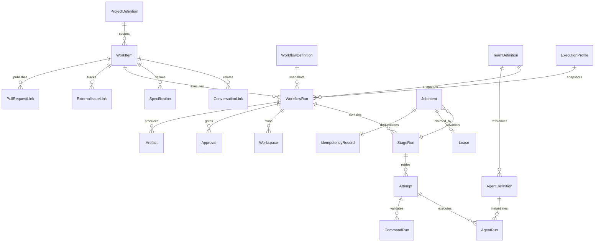

# Factory domain model

This document defines the factory domain. The current factory phases implement the minimal
WorkItem, WorkflowRun, StageRun, Attempt, JobIntent/Lease, IdempotencyRecord,
Approval, Artifact metadata, WorkflowEvent, and CommandRun subset needed by the
fixed simulation plus one deterministic validating check. ProjectDefinition,
definitions, agent/workspace runs, and
external links remain planned unless explicitly stated otherwise.

## Domain boundary

The interactive domain owns human-directed projects, conversations, threads,
turns, messages, provider sessions, interactive approvals, checkpoints, diffs,
terminals, and previews. The factory domain owns durable work and execution.

A Conversation may link to a WorkItem, but neither is contained by the other.
`ThreadId`, `TurnId`, provider-native task IDs, terminal state, and process state
must never be lifecycle authorities for a WorkflowRun.

## Entity relationship

## Objects

### ProjectDefinition

- **Purpose:** registers a repository and the configuration used to operate it.
- **Identity:** stable MK Code project ID; filesystem path is mutable metadata,
  not identity.
- **Lifecycle:** registered, enabled/disabled, archived.
- **Relationships:** WorkItems, configuration snapshots, integration mappings.
- **Snapshot:** active runs capture repository revision and resolved project
  configuration.
- **Prohibited:** owning an interactive thread or storing provider credentials.
- **Implemented precursor:** `apps/server/src/projectRegistry.ts` records the
  stable project ID, canonical repository path, enabled state, validation
  metadata, and last `ResolvedProjectConfiguration` in a server-owned JSON
  store. It is control-plane registration metadata, not the future
  factory-persistence ProjectDefinition aggregate.

### ConversationLink

- **Purpose:** associates a WorkItem with an interactive conversation without
  merging lifecycles.
- **Identity:** WorkItem ID plus conversation/environment identity.
- **Mutable:** label and relation kind; the linked IDs are immutable.
- **Source of truth:** factory persistence for the link; interactive persistence
  for the conversation.
- **Prohibited:** determining workflow status.

### Specification

- **Purpose:** versioned problem statement, acceptance criteria, constraints, or
  imported plan attached to a WorkItem.
- **Identity:** specification ID and monotonically increasing version.
- **Lifecycle:** draft, accepted, superseded.
- **Snapshot:** a WorkflowRun records the exact accepted version it uses.
- **Prohibited:** executable commands or embedded secrets.

### WorkItem

- **Purpose:** durable statement of work independent of its intake channel.
- **Identity:** stable WorkItem ID.
- **Lifecycle:** proposed, ready, active, awaiting-review, completed, cancelled.
- **Relationships:** many conversations, specifications, workflow runs, attempts,
  and external links.
- **Mutable:** summary, prioritization, current disposition, links.
- **Prohibited:** deriving completion directly from a conversation, Linear issue,
  or pull request.
- **Implemented subset:** provider-neutral manual/conversation/integration source
  and optional opaque external-reference metadata in factory SQLite.

### WorkflowDefinition

- **Purpose:** versioned stage graph, gates, role requirements, retry policies,
  and transitions.
- **Identity:** definition key plus immutable version.
- **Lifecycle:** draft, active, deprecated.
- **Snapshot:** every run stores the resolved version and expanded stage graph.
- **Prohibited:** provider/model selection and arbitrary unvalidated process
  launch.

### WorkflowRun

- **Purpose:** one durable execution of a WorkItem.
- **Identity:** stable run ID.
- **Lifecycle:** queued, running, awaiting-approval, succeeded, failed, cancelled.
- **Implemented snapshot:** immutable resolved project configuration and its
  digest.
- **Target/deferred snapshots:** workflow, team, agents, execution profiles,
  input specifications, and source revision.
- **Source of truth:** factory persistence exclusively.
- **Prohibited:** silent mutation from later definition changes.
- **Implemented subset:** an immutable resolved project snapshot and digest,
  fixed simulated workflow type, cancellation/terminal state, and optimistic
  version. Team/agent/profile/workflow-definition snapshots are deferred.

### StageRun

- **Purpose:** materialized execution state for one stage in a WorkflowRun.
- **Identity:** run ID plus stage instance ID.
- **Lifecycle:** blocked, ready, running, awaiting-approval, succeeded, failed,
  skipped, cancelled.
- **Relationships:** attempts, job intents, approvals, artifacts.
- **Prohibited:** changing status based only on runtime output.
- **Implemented subset:** planning, implementing, validating, and human-review
  materializations with sequence, attempt count, timestamps, outcome, failure
  classification, and optimistic version.

### Attempt

- **Purpose:** one bounded try at completing a StageRun.
- **Identity:** stage ID plus attempt number.
- **Lifecycle:** queued, claimed, running, succeeded, failed, cancelled, expired.
- **Mutable:** timestamps, failure classification, lease association.
- **Prohibited:** exceeding the snapshotted retry policy.
- **Implemented subset:** one row per claim/reclaim with retry ancestry and
  expired/failed/cancelled outcomes; persisted `completed` is the lifecycle
  `succeeded` outcome.

### AgentDefinition

- **Purpose:** provider-neutral responsibility, capabilities, permissions, and
  expected input/output contract.
- **Identity:** stable definition key plus version.
- **Prohibited:** provider, model, process-host, or secret selection.

### TeamDefinition

- **Purpose:** versioned composition of orchestrator, team-lead, and worker role
  slots, including delegation policy.
- **Identity:** stable definition key plus version.
- **Prohibited:** launching processes or bypassing workflow policy.

### ExecutionProfile

- **Purpose:** resolves a role to runtime adapter, configured provider instance,
  model, ProcessHost, sandbox, approval policy, secret references, and resource
  limits.
- **Identity:** stable profile key plus version.
- **Snapshot:** fully resolved into each active WorkflowRun.
- **Prohibited:** changing the semantic responsibility of an agent.

### AgentRun

- **Purpose:** one execution of an AgentDefinition for an Attempt.
- **Identity:** stable AgentRun ID.
- **Lifecycle:** queued, starting, running, awaiting-input, stopped, succeeded,
  failed, cancelled, lost.
- **Relationships:** runtime session, hosted process, input/output artifacts.
- **Prohibited:** directly launching child agents; it may request delegation.

### CommandRun

- **Purpose:** recorded deterministic command execution.
- **Identity:** stable command-run ID; the stage has at most one current
  phase-specific CommandRun.
- **Lifecycle:** pending → starting → running → passed/failed/timed_out/
  cancelled/spawn_failed/terminated; uncertain local ownership becomes
  operator_attention.
- **Fields:** immutable snapshotted definition, command category/ID, Attempt,
  execution root, executable, ordered arguments, environment-reference names,
  process-host execution identity, optional native PID, timeout deadline,
  exit/signal, byte/truncation counts, redacted output references/digests,
  outcome, failure classification, and optimistic version.
- **Source of truth:** process result captured by controller code.
- **Mutable versus snapshotted:** definition and execution root are copied from
  WorkflowRun; lifecycle/output fields are durable execution state.
- **Prohibited:** resolved secret values, raw output, OS-PID-only identity,
  caller-supplied executables, or treating an agent statement as success.
- **Implemented:** migration 2 and `WorkflowEngine` own this record; output
  contents live as restricted factory-state artifacts rather than SQLite blobs.

### Workspace

- **Purpose:** factory-owned worktree, or later sandbox type, used by exactly one
  WorkflowRun as its command execution root.
- **Identity:** stable workspace ID; one active WorkflowRun has at most one
  primary Workspace and canonical paths/branches are uniqueness-fenced.
- **Lifecycle:** pending → allocating → ready → retained → cleanup_pending →
  removed, with allocation_failed, missing, ownership_mismatch, modified,
  cleanup_failed, and operator_attention exceptions.
- **Fields:** source/canonical repository paths, Git common-directory identity,
  requested base branch, resolved ref and immutable commit, deterministic branch,
  configured and effective roots, canonical worktree path, pre-allocation claim
  path, administrative marker path/digest, observed HEAD/branch/dirty metadata,
  timestamps, failures, and optimistic version.
- **Source of truth:** factory SQLite owns lifecycle; the transient allocation
  claim, Git metadata, and administrative marker are external evidence
  reconciled against the durable record.
- **Mutable versus snapshotted:** allocation identity/base/branch/path are fixed
  before side effects; observations, retention, cleanup, and failure state evolve.
- **Prohibited:** using the registered primary checkout for new command-backed
  runs, recreating missing active worktrees silently, force-removing dirty or
  ambiguous directories, deleting the retained branch, or treating a worktree as
  a security sandbox.
- **Implemented:** migration 3, workflow-engine lifecycle methods,
  `GitWorktreeWorkspaceManager`, worker reconciliation, and authenticated
  read/cleanup endpoints.

### Approval

- **Purpose:** durable human or policy decision at a workflow gate.
- **Identity:** approval ID and idempotency key.
- **Lifecycle:** pending, approved, rejected, expired, cancelled.
- **Prohibited:** existing only as an in-memory provider callback.
- **Implemented subset:** durable human-review pending/approved/rejected/
  cancelled decisions. Approval resolution is authenticated at the worker API.

### Artifact

- **Purpose:** immutable or content-addressed reference to specifications,
  patches, logs, command output, reports, diffs, and build products.
- **Identity:** artifact ID plus checksum where available.
- **Prohibited:** silently overwriting evidence from an earlier attempt.
- **Implemented subset:** metadata table and read contract only; simulation
  creates no artifacts and SQLite never stores large contents.

### ExternalIssueLink and PullRequestLink

- **Purpose:** idempotent integration records for Linear-like issues and GitHub
  pull requests.
- **Identity:** integration ID plus remote object ID.
- **Source of truth:** factory persistence owns synchronization state; remote
  systems own their objects.
- **Prohibited:** remote status directly advancing a run without policy checks.

### JobIntent

- **Purpose:** transactional outbox/work record for a required side effect.
- **Identity:** stable job ID and idempotency key.
- **Invariant:** the workflow transition and its JobIntent are committed in one
  transaction.
- **Prohibited:** ephemeral-only queueing.
- **Implemented subset:** fixed simulation job types, versioned JSON payload,
  availability, claim count, lease fields, completion metadata, and terminal
  failure. A unique stage/job idempotency key prevents duplicate intents.

### Lease

- **Purpose:** expiring claim on a JobIntent.
- **Identity:** job ID, worker ID, claim token.
- **Mutable:** claimed-at, heartbeat, expires-at.
- **Invariant:** stale leases are reclaimable; completion validates the token.
- **Implemented subset:** owner plus expiration on JobIntent; only the owner may
  renew or complete, and expired claims create a later Attempt after recovery.

### IdempotencyRecord

- **Purpose:** records the accepted request and outcome for a side-effect key.
- **Identity:** scoped idempotency key.
- **Invariant:** duplicate delivery returns or reconciles the prior outcome
  instead of repeating irreversible effects.
- **Implemented subset:** workflow-create scope stores canonical request digest
  and run reference. Same input replays the result; conflicting input returns a
  deterministic conflict.

## Durability invariants

1. State transition and JobIntent persist atomically.
2. Jobs use idempotency keys and expiring leases.
3. Crash recovery reclaims or reconciles incomplete work.
4. Duplicate delivery cannot repeat irreversible side effects.
5. Runtime events, process state, and terminal output are observations.
6. Deterministic CommandRuns decide validation outcomes.
7. Approvals survive worker and runtime restarts.
8. Active runs use immutable definition snapshots.
9. Only factory controller code advances workflow state.
