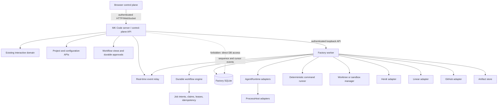
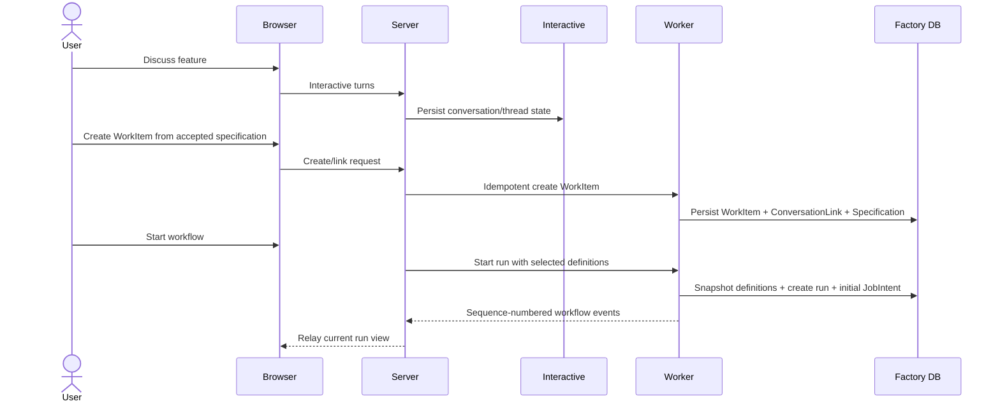
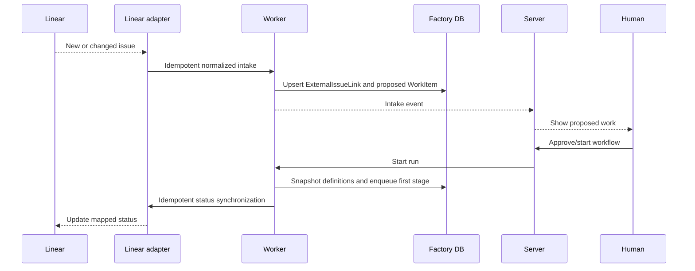
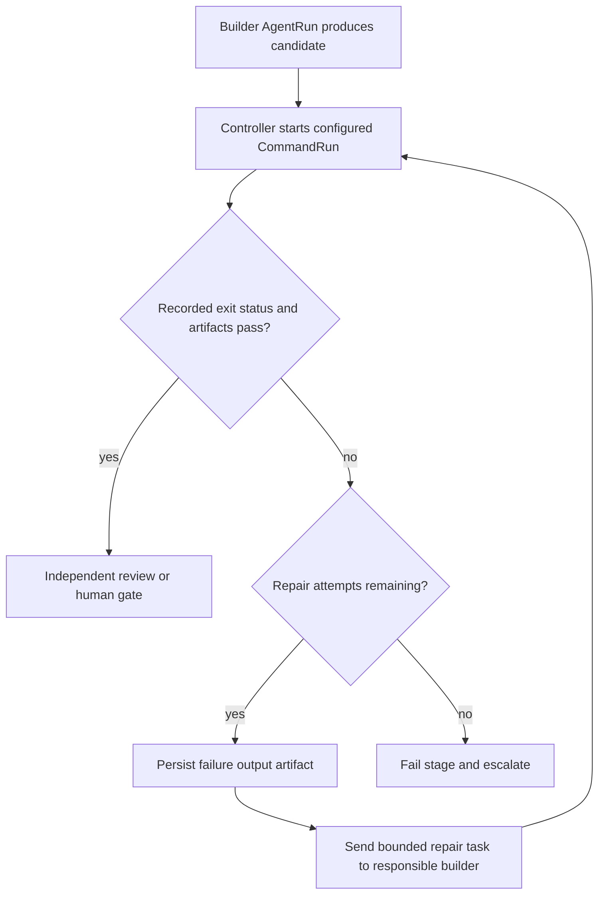
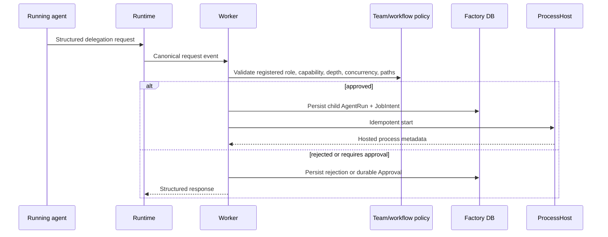
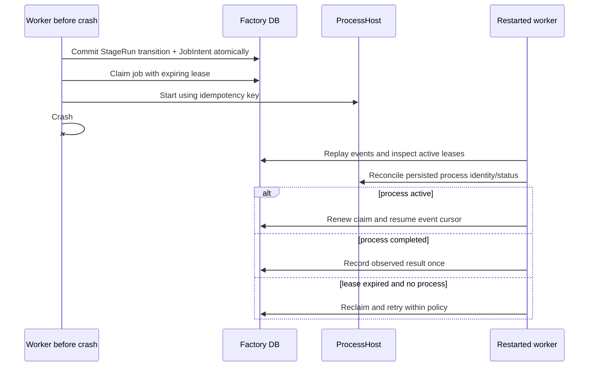

# Target architecture

## Decision

MK Code will retain the current interactive browser/server system while adding a
separate durable factory domain and factory-worker process. The browser server is
the only public control plane. The factory worker exclusively owns separate
factory persistence and exposes a narrow authenticated loopback API and resumable
event feed.

The Phase 5 persistence/API skeleton of this target is now implemented. Runtime
adapters, ProcessHosts, deterministic commands, workspaces, registries,
integrations, and browser workflow views remain target components.

This approach reuses proven provider, event, Git, auth, and connection patterns
without making interactive threads or a browser request process authoritative
for long-running work.

## Options considered

### Extend current thread orchestration

Add workflow stages to the existing project/thread aggregate and execute them in
the server reactors. This has the lowest initial code cost but preserves the
hot-stream side-effect gap, expands an already broad server, and couples workflow
truth to conversations and provider sessions. Rejected.

### Separate factory packages and worker

Keep interactive behavior stable, reuse patterns and narrow adapters, and add a
factory worker with independent persistence. This costs a process boundary and
some duplicated infrastructure, but creates explicit ownership and restart
semantics. Recommended.

### External distributed workflow platform immediately

Use an external database, queue, and workflow service from the start. This could
support scale and high availability but adds operational dependencies before the
single-operator workflow is proven. Deferred until multiple workers, multiple
operators, or HA becomes a real requirement.

## Overall architecture

## Component ownership

### Browser control plane

Uses server-owned APIs and event contracts to register projects, conduct
interactive conversations, create/link WorkItems, start or cancel runs, present
stage/attempt/agent/command/artifact history, and record approvals. It never owns
workflow transitions and never imports worker implementation code.

### MK Code server

Retains the existing interactive session domain and its SQLite database. It owns
browser authentication, project/configuration read APIs, definition discovery,
workflow query/command proxying, and real-time relay. It resolves user identity
and forwards authorized, idempotent commands to the worker. It must not open,
query, migrate, or modify factory persistence.

### Factory worker

Runs as a separate service and exclusively owns WorkflowRuns, stages, attempts,
jobs, leases, AgentRuns, CommandRuns, approvals, workspaces, artifacts,
integration synchronization, and workflow event history. It claims recoverable
jobs and reconciles state before accepting new work after restart.

**Implemented now:** `apps/factory-worker` provides the separate process,
loopback API, credential check, polling simulation loop, startup reconciliation,
graceful shutdown, and one declared-check execution handler. Process launch is
delegated to `packages/command-runner`; the worker still contains no worktree,
Git, agent, provider, or integration launcher.

### Durable workflow engine

Implements a deterministic state machine over immutable run snapshots. A state
transition and corresponding JobIntent/outbox record commit atomically. It
validates retries, gates, delegation, and stage completion. It never consumes a
provider's “done” signal as sufficient validation.

**Implemented now:** `packages/workflow-engine` implements the fixed simulated
stage sequence, transactional JobIntents, claims/leases, capped injectable
retries, cancellation, durable human review, idempotent create/decision paths,
cursor events, and recovery in separate SQLite. A generalized workflow
definition language remains deferred.

Migration 2 and the engine now also own durable CommandRuns, command lifecycle
events, output artifact metadata, selected-check resolution, cancellation
fences, and conservative local-process recovery. These additions do not give
the engine permission to spawn a process.

### Registries

Version-one definitions are files under `registry/agents`, `registry/teams`,
`registry/workflows`, and `registry/execution-profiles`. The server exposes
validated read APIs; the worker snapshots fully resolved definitions into each
run. Browser CRUD is deferred until the schemas stabilize.

The project registry maps stable ProjectDefinition identities to approved local
repository directories and checked-in `.mkcode/project.yaml` configuration.

The first control-plane slice now exists as `packages/project-config`,
`packages/contracts/src/projectRegistry.ts`, and
`apps/server/src/projectRegistry.ts`. Its isolated atomic JSON registration
file is a deliberate single-server stepping stone, not factory persistence. The
future worker receives immutable resolved project snapshots through a typed
boundary; it must not open or repurpose the registration file as workflow truth.

### Runtime adapters

The target AgentRuntime package extracts the narrow execution/session/event
contract from the current provider system. Existing adapters are bridged one at
a time. AgentDefinition and TeamDefinition never import runtime, provider, or
model types; ExecutionProfile performs that binding.

### Process-host adapters

LocalProcessHost starts child process groups and captures exit/output/recovery
metadata. A later HerdrProcessHost supplies persistent PTYs, raw output, remote
attachment, manual intervention, and restoration metadata behind the same port.
Neither host advances workflow state.

**Implemented now:** `packages/command-runner/src/processHost.ts` implements the
Linux-first local host. It starts direct child processes with no shell and a
distinct process group, and signals only execution IDs present in its own
in-memory child map. Restart reattachment remains deliberately unsupported.

### Deterministic command runner

Executes project-declared executable-plus-argument arrays in an owned Workspace.
It records environment references, working directory, timeout, cancellation,
exit code or signal, redacted output, and artifacts. Controller policy maps those
facts to validation outcomes.

**Implemented now:** a workflow may select one validation check ID at creation.
The worker resolves that ID from the stored project snapshot, revalidates the
canonical working directory immediately before launch, supplies a minimal
allowlisted environment plus declared references, redacts output before
persistence, and records explicit exit/signal/timeout/cancellation outcomes.
Setup commands are supported by the snapshot resolver but are not yet scheduled
by the phase-specific workflow.

### Workspace manager

Allocates and owns worktrees under configured roots, records ownership before
destructive operations, reconciles interrupted allocation/cleanup, and exposes a
future sandbox seam. Existing Git primitives are reused behind this worker-owned
interface; interactive checkpoints remain in the interactive domain.

### Integration ports

- Herdr: process hosting and observation only.
- Linear: idempotent intake and status synchronization, not workflow storage.
- GitHub: branch, commit, draft pull request, and review metadata; no automatic
  merge in version one.

## Persistence and durability

Interactive SQLite and factory SQLite are physically and logically separate.
The worker is the sole writer and reader of factory SQLite. The server communicates
through typed commands, queries, and sequence-numbered events.

Each accepted workflow transition stores:

1. the updated aggregate/version;
2. an append-only domain event;
3. projection updates or replay cursor policy;
4. the required JobIntent/outbox record; and
5. command/idempotency receipt;

in one transaction where applicable.

Claims have worker identity, claim token, heartbeat, and expiry. A crashed worker
leaves reclaimable leases. Completion validates the claim token and idempotency
record. Irreversible integrations use remote reconciliation keys before retry.

Active runs snapshot project configuration content/revision and resolved
WorkflowDefinition, TeamDefinition, AgentDefinitions, and ExecutionProfiles.
Definition changes create new versions for later runs.

## Manual chat-to-workflow flow

The conversation remains usable and independently mutable after WorkItem
creation. Later conversation turns do not silently modify the accepted
Specification or active WorkflowRun.

## Linear-to-workflow flow

Polling or manual synchronization is the default before public webhook ingress
and ownership are decided.

## Validation failure repair loop

The builder does not choose the command, suppress its output, or declare it
successful. The project configuration and workflow snapshot determine the
validation command and retry limit.

## Agent delegation flow

Agents request delegation; only deterministic worker code launches the instance.

## Worker crash and recovery

## Real-time events and approvals

Worker events have global sequence, stable event identity, run/stage correlation,
and schema version. The server subscribes with a cursor, persists or caches only
browser-facing projections it owns, and replays after reconnect. The browser
detects gaps and requests a fresh query/cursor; it does not infer transitions.

Approvals are factory records with subject, policy reason, requested action,
expiry, actor, and decision. A provider-local callback is an execution detail
that the worker can reconstruct or reconcile from the durable Approval.

Artifacts use immutable references and checksums where practical. Large command
output and build products are not embedded wholesale in events.

## Deployment layout

Version one deploys:

- one trusted operator;
- one headless Linux Mini PC;
- one MK Code server systemd service;
- one factory-worker systemd service;
- existing interactive SQLite;
- separate factory SQLite;
- loopback-only worker API;
- browser server exposed through Tailscale Serve; and
- no distributed workers.

Backups, service restart ordering, database restoration, disk-pressure policy,
credential rotation, and process reconciliation are required operational
documentation before unattended use.

## Existing component disposition

### Reuse

- Browser/server interactive flow.
- Local pairing/session auth and Tailscale.
- Contracts/schema conventions and client reconnect patterns.
- Canonical provider runtime events and provider-instance identities.
- Codex and ACP protocol packages.
- SQLite event/receipt/projection techniques.
- VCS registry and Git/worktree primitives.

### Extend

- Server APIs with project/definition views and worker proxy/event relay.
- Provider adapters with a narrower factory runtime bridge.
- Project scripts into a structured project-configuration schema.
- Observability with workflow correlation and worker health.

### Isolate, freeze, then remove or replace

- T3 Connect, Clerk, relay, and upstream Axiom configuration.
- Desktop/mobile bridge and distribution behavior.
- Marketing and T3-specific legal pages.
- Public T3 release channels, package identity, and hosted domains.
- Upstream PostHog analytics.

## Forbidden dependencies

- Workflow packages importing UI packages or browser components.
- Browser server opening or migrating factory persistence.
- Factory worker importing browser component code.
- AgentDefinition or TeamDefinition embedding providers or models.
- Herdr, provider-native tasks, terminals, or process status becoming workflow
  truth.
- Interactive thread/turn records becoming workflow truth.
- Application repositories importing MK Code production internals.
- Project configuration containing resolved secrets.
- UI code performing workflow transitions without worker validation.
- Integrations bypassing WorkItem/run idempotency and policy.

## Human-review boundary

Before Git publication, the operator sees the accepted specification, change
summary/diff, stage and attempt history, deterministic command outcomes,
independent review, unresolved risks, and artifacts. Approval authorizes the
next explicit action; it does not authorize merge or deployment unless a later
workflow contains separate, deliberately approved gates.
